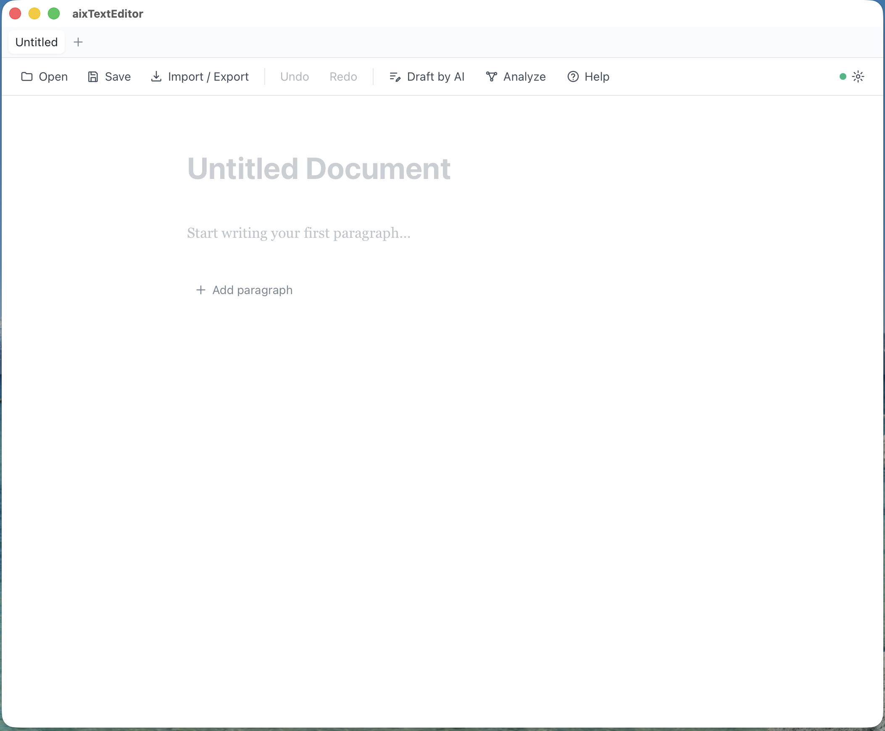
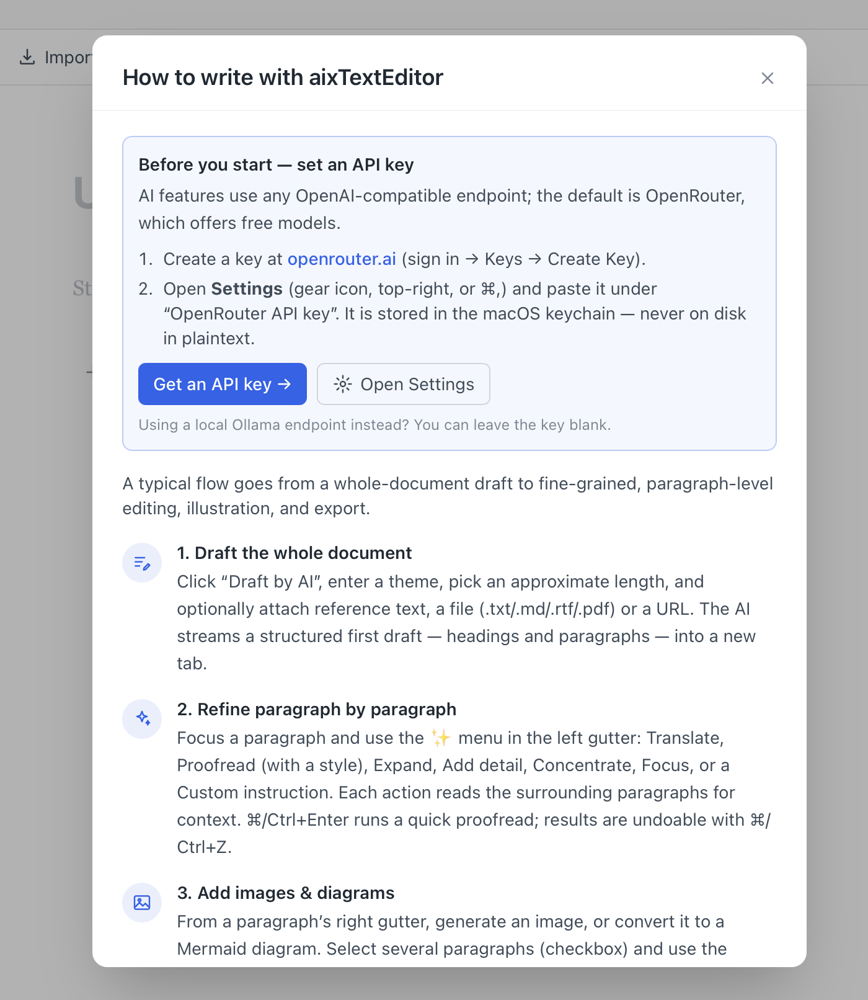
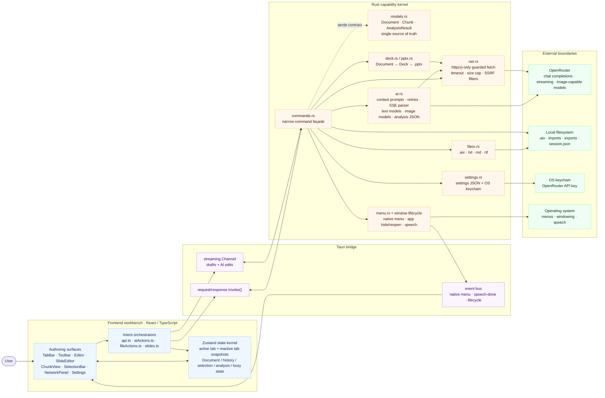

<div align="center">

<br/>


<br/>

# ─── ✦ &nbsp; a i x T e x t E d i t o r &nbsp; ✦ ───

<h3>
  <em>🧠 AI &nbsp;×&nbsp; 📝 Chunks &nbsp;—&nbsp; The Next-Generation Writing Experience</em>
</h3>

<br/>

[](https://github.com/kumeS/aixTextEditor/releases)
&nbsp;
[](LICENSE)
&nbsp;
[](https://github.com/kumeS/aixTextEditor/releases)

[](https://v2.tauri.app)
&nbsp;
[](https://www.rust-lang.org)
&nbsp;
[](https://react.dev)
&nbsp;
[](https://www.typescriptlang.org)

<br/>

---

<h2>📝 Every Paragraph is a Chunk.&nbsp; AI Understands Every Chunk.</h2>

---

</div>

<br/>

<div align="center">
<table>
<tr>
<td align="center" width="33%">
<h3>🚀 Streaming Draft</h3>
<p>Enter a theme → watch a fully structured<br/>first draft generate <strong>in real time</strong></p>
</td>
<td align="center" width="33%">
<h3>🎨 AI Image Generation</h3>
<p>Turn any paragraph into a visual —<br/><strong>images generated from your words</strong></p>
</td>
<td align="center" width="33%">
<h3>🔗 Relationship Graph</h3>
<p>Map the logical structure between<br/>paragraphs with <strong>interactive networks</strong></p>
</td>
</tr>
</table>
</div>

<br/>

> ### ✨ What is aixTextEditor?
>
> A **radically new** text editor where every paragraph lives as an independent **chunk** — think Jupyter Notebook cells, but for writing.
>
> Each chunk is a self-contained unit for editing **and** AI-powered operations:
> **translate** · **proofread** · **summarize** · **expand** · **generate diagrams** · **generate images** · **analyze relationships** — all executed with full awareness of surrounding context.
>
> _Supercharge your writing — papers, reports, technical docs — **with AI, one chunk at a time.**_

<br/>

## 📸 See it in action

### 1. The writing canvas

<div align="center">
  
</div>

> **A distraction-free, chunk-based canvas.** Every document is an ordered list of _chunks_ — paragraphs, headings, diagrams, images. The toolbar keeps the essentials one click away (**Open / Save**, **Import / Export**, **Undo / Redo**, **Draft by AI**, **Analyze**, **Help**) while the page itself stays quiet so you can focus on writing.

**Quick start**

1. Launch the app — a fresh **Untitled Document** opens automatically.
2. Click the title to rename it, or just start typing in the first paragraph.
3. Press **➕ Add paragraph** (or `⌘/Ctrl+Shift+Enter` to split at the caret) to grow the document chunk by chunk. Begin a line with `# `, `## ` or `### ` to turn it into a heading.
4. Need another document? Open a new tab with the tab-bar **＋** or `⌘/Ctrl+T` — each tab keeps its own file, history and analysis.

<br/>

### 2. Draft → refine → review (the core workflow)

<div align="center">
  
</div>

> **From a one-line theme to a polished draft — then sharpen it paragraph by paragraph.** The clip walks through the whole loop: generate a structured first draft, then use the per-chunk **✨** menu to revise, with every AI edit shown as a reviewable diff you can keep or undo.

**Tutorial — follow along**

1. **Draft the whole document.** Click **Draft by AI**, type a theme (here, _“BTC trend”_), pick an approximate length, and optionally attach reference text, a file (`.txt/.md/.rtf/.pdf`) or a URL. Hit **Draft** and the AI **streams** a structured first draft — headings + paragraphs — into a new tab (_“Draft created — 8 chunks”_).
2. **Refine paragraph by paragraph.** Focus any paragraph and open the **✨** menu in the left gutter: **Translate**, **Proofread**, **Revise with context**, **Expand**, **Add detail**, **Concentrate**, **Focus**, **Summarize**, **Generate diagram**, or a **Custom instruction**. Each action reads the surrounding chunks so the result stays coherent.
3. **Review the change.** Edits appear as an inline **diff** (_What changed vs previous_) — strikethrough for removals, highlight for additions. Keep it, hit **Revert**, or undo with `⌘/Ctrl+Z`.
4. **Iterate** across chunks until it reads the way you want, then **Save** as `.aix` (lossless) or **Export** to `.txt/.md/.rtf`.

> 💡 **Tip:** `⌘/Ctrl+Enter` runs a quick **Proofread** on the focused paragraph — the fastest way to tidy a single chunk.

<br/>

### 3. Built-in guide (multilingual)

<div align="center">
  
</div>

> **Help is always one click away.** The **Help** button (toolbar or native Help menu) opens a step-by-step guide to the recommended workflow, plus a one-time **API-key setup** walkthrough. The guide is available in **five languages — English, 日本語, 中文, Español, Français** — chosen from the selector beside the title, and it follows your **Default language** in Settings automatically.

**Before your first AI action**

1. Create a free key at **[openrouter.ai](https://openrouter.ai/keys)** (sign in → **Keys** → **Create Key**).
2. Open **Settings** (gear icon, or `⌘/Ctrl+,`) and paste it under **OpenRouter API key** — it’s stored in the **macOS keychain**, never on disk in plaintext.
3. _(Optional)_ Choose your text / image models and **Default language**. Prefer a local **Ollama** endpoint? Leave the key blank.

<br/>

## Features

| Area | What it does |
| --- | --- |
| **Multiple tabs** | Open and edit several documents at once. New tab via the tab-bar **＋** or `⌘/Ctrl+T`; each tab keeps its own document, file path, undo/redo history and analysis. |
| **Chunk editing** | Document = an ordered list of chunks. Split (`⌘/Ctrl+Shift+Enter`), merge (Backspace at start), reorder (↑/↓), add/delete, and move between chunks with the Up/Down arrows. |
| **Chunk types** | **Text**, **Heading** (`#`/`##`/`###`, levels 1–3), **Diagram** (Mermaid), and **Image**. Type `# `/`## `/`### ` at the start of a paragraph to turn it into a heading. |
| **Context-aware AI** | The nearest preceding/following text chunks are sent as context so generated text stays coherent. |
| **Per-chunk AI menu (✨)** | **Translate** (choose language), **Proofread** (choose a style: Academic / Formal / Concise / Plain / Persuasive / custom), **Expand**, **Add detail**, **Concentrate**, **Focus**, **Summarize**, **Generate diagram**, **Custom instruction**. `⌘/Ctrl+Enter` runs Proofread. |
| **Draft (streaming)** | Generate a full structured first draft from a theme; it **streams into a new tab in real time**, split into heading + paragraph chunks. |
| **Diagrams** | The model emits **Mermaid** code, rendered inline as SVG; diagram chunks keep an editable code area. |
| **Image generation** | Generate an image from a single paragraph (right-gutter button), or select multiple paragraphs (checkbox → floating **Generate image**) to combine them. Images are inserted as **image chunks** and can be reordered. Uses a separate image model (see Settings). |
| **Relationship graph** | **Analyze** builds a two-level network — **paragraph** nodes plus per-**sentence** nodes — with typed relations (cause, evidence, elaboration, contrast, …), drawn with **Cytoscape** (sentences nested under their paragraph). Click a node to jump to its paragraph. The graph is saved inside the `.aix` file. |
| **Import / Export** | One **Import / Export** menu (choose after clicking): import/export `.txt`, `.md`, `.rtf`. Native **`.aix`** format (Save/Open) preserves the full document — chunks, metadata and the analysis graph. |
| **Native menu** | The macOS/Windows menu bar (File / Edit / AI / Window) mirrors the in-app toolbar; its custom items drive the same actions. |
| **Security** | The API key is stored in the **OS keychain** (macOS Keychain / Windows Credential Manager / Linux Secret Service) — never written to disk in plaintext, never sent to the frontend. All network calls happen in Rust. |
| **Resilience** | Free models are rate-limited; API calls retry on HTTP 429 / transient 5xx with exponential backoff, and surface actionable errors. |
| **Performance** | Per-chunk selectors (only the edited paragraph re-renders), async ops with loading indicators, lazy-loaded Mermaid/Cytoscape. |

## Settings

Open with the gear icon or `⌘/Ctrl+,`:

- **OpenRouter API key** — stored in the OS keychain.
- **Endpoint URL** — any OpenAI-compatible chat-completions endpoint.
- **Model (text)** — a managed list you can select from / add to / remove. Used
  for writing, proofreading, drafting and analysis.
- **Model (image generation)** — a separate managed list for image models
  (e.g. Google "Nano Banana"). **Verify exact model ids on
  openrouter.ai/models** — image-model ids change frequently and the seeded ones
  are starting points.
- **Default translation language** — picked from a dropdown (English, 日本語,
  中文, 한국어, Español, Français, …).
- **Temperature**.

## Keyboard shortcuts

| Shortcut | Action |
| --- | --- |
| `↑` / `↓` (at a paragraph's top/bottom line) | Move to the previous / next chunk |
| `⌘/Ctrl + Enter` | Proofread the focused paragraph |
| `⌘/Ctrl + Shift + Enter` | Split paragraph at the caret |
| `Backspace` (at start) | Merge with previous paragraph (empty heading → text) |
| `⌘/Ctrl + T` | New tab |
| `⌘/Ctrl + S` / `O` | Save / Open `.aix` document |
| `⌘/Ctrl + Z` / `Shift+Z` | Undo / Redo |
| `⌘/Ctrl + ,` | Settings |

## Architecture

### 🔀 High-level data flow

aixTextEditor is deliberately split into a **stateful authoring workbench** in
React and a **capability boundary** in Rust. The frontend decides _what the user is
doing_; the backend owns everything that touches the outside world — files, the
network, the OS keychain, native menus and speech.

The central contract is the typed document model:

> `Document` → ordered `Chunk[]` → text / heading / diagram / image chunks, plus
> persisted analysis graph metadata.

That model is defined in Rust (`models.rs`), mirrored in TypeScript (`types.ts`),
and passed over Tauri IPC with `serde`/camelCase intact.



**Reading the flow**

- **The store is the workbench brain.** The active tab is kept in live top-level
  fields, while inactive tabs are stored as snapshots. Chunk edits, selection,
  undo/redo, analysis and busy state all converge in `store.ts`.
- **IPC is intentionally narrow.** The frontend sends intent (`draft`,
  `proofread`, `generate image`, `export pptx`, `save .aix`); Rust owns the
  side effects. API keys never cross into React.
- **Streaming is first-class.** Draft generation and long AI edits return
  incremental `Document` snapshots over a Tauri `Channel`, so chunks appear in
  place instead of waiting for a full response.
- **AI has two output paths.** Text/analysis/diagram actions return structured
  text or JSON; image actions extract a generated image URL/data payload and
  insert it as an image chunk.
- **Files are format adapters, not the source of truth.** `.aix` is the lossless
  document format. `.txt`, `.md`, `.rtf` and `.pptx` are exports/imports derived
  from the chunk graph.
- **Remote input is filtered.** Reference URLs and remote image/document fetches
  go through `net.rs`, which restricts schemes, hosts, response size and timeout
  before data reaches AI prompts or PPTX generation.
- **Native shell integration is event-driven.** Menu clicks, macOS hide/reopen
  behavior and speech completion flow through Rust and then back to the same
  frontend actions used by the toolbar.

### Project layout

```
src/                     React frontend
  types.ts               TS mirror of the Rust model (camelCase)
  api.ts                 Typed invoke() wrappers (+ streaming Channel)
  store.ts               Zustand store: tabs, chunks, undo/redo, selection, autosave
  aiActions.ts           AI orchestration (context, busy state, tab-race guards)
  fileActions.ts         New/Open/Import/Export/Draft/PPTX (dialog → Rust I/O)
  slides.ts              Deck derivation (mirrors deck.rs) for the Slide view
  caret.ts               Visual-line caret detection (chunk Up/Down navigation)
  useShortcuts.ts        Global keyboard shortcuts
  components/            TabBar, Toolbar, Editor, SlideEditor, ChunkView,
                         ChunkAiMenu, MermaidChunk, NetworkPanel, SettingsModal,
                         PromptModal, SelectionBar, Toasts, ErrorBoundary, icons
src-tauri/src/           Rust backend
  lib.rs                 Tauri builder: commands, native menu, window lifecycle
  models.rs              Document / Chunk / ChunkMetadata / Analysis* (serde)
  commands.rs            Tauri command surface
  ai.rs                  LlmProvider trait + OpenRouter impl (SSE streaming,
                         image generation) + prompts
  deck.rs + pptx.rs      Document → Deck → hand-written .pptx (OOXML)
  fileio.rs              txt/md/rtf import-export, paragraph + heading chunking
  net.rs                 SSRF-guarded, size-capped remote fetch
  settings.rs            Settings JSON + OS keychain (keyring)
  menu.rs                Native application menu (emits events to the frontend)
  cli.rs                 Headless CLI (capabilities / info / export)
  error.rs               Unified AppError
```

The AI layer is expressed as a trait (`LlmProvider`) so other OpenAI-compatible
providers can be slotted in without touching the command layer. State is managed
with **Zustand** for fine-grained per-chunk selector subscriptions; the active
tab lives in the top-level store fields while inactive tabs are kept as
snapshots, so existing chunk actions operate unchanged.

## Getting started

### Install (recommended) — Homebrew

```bash
brew tap kumeS/tap https://github.com/kumeS/aixTextEditor   # one-time: the formula lives in this repo
brew install kumeS/tap/aixtexteditor
```

> The `brew tap … <url>` line is required because the formula ships inside the app's
> own repo rather than a separate `homebrew-tap` repo. (If you later create a
> `kumeS/homebrew-tap` repo containing the formula, `brew install
> kumeS/tap/aixtexteditor` works on its own, with no `brew tap` step.)

This **builds aixTextEditor from source on your Mac**, so there is no notarization
/ *"app is damaged"* Gatekeeper prompt, and the binary matches your own CPU (Apple
Silicon or Intel). Homebrew installs Node and Rust automatically (Xcode Command
Line Tools required); the first build takes a few minutes.

Launch it from Spotlight as **aixTextEditor**, or:

```bash
aixtexteditor                                                    # CLI launcher
# …or add it to /Applications:
ln -sfn "$(brew --prefix)/opt/aixtexteditor/aixTextEditor.app" /Applications/
```

On first run, open **Settings** (gear icon, or `⌘/Ctrl+,`) and paste your
OpenRouter API key (free key at https://openrouter.ai/keys). The default text model
is free; change it (and the image model) to any id from
https://openrouter.ai/models. The key is stored in the macOS keychain, never on
disk in plaintext.

> **Prebuilt `.dmg` alternative.** A `.dmg` is also published on the
> [Releases](https://github.com/kumeS/aixTextEditor/releases) page (and via the
> Homebrew **cask** [`Casks/aix-text-editor.rb`](Casks/aix-text-editor.rb)). That
> build is *not notarized*, so macOS quarantines it on download — after installing,
> clear the flag once with
> `xattr -dr com.apple.quarantine "/Applications/aixTextEditor.app"`. The
> source build above avoids this entirely.

### Building from source manually (optional)

```bash
npm install
npm run tauri build    # → .app / .dmg under src-tauri/target/release/bundle/
```

## Notes & limitations

- AI features require an OpenRouter API key; image generation additionally
  requires an **image-capable** model id (verify on openrouter.ai/models).
- Free OpenRouter models share tight rate limits — if you hit 429 repeatedly,
  switch models in Settings, wait a minute, or add OpenRouter credit.
- `.rtf` conversion is pragmatic (text + paragraph structure), not full
  rich-text fidelity. `\'hh` byte escapes are decoded through Windows-1252, so
  smart quotes / dashes / bullets from Word-exported `.rtf` survive import.
- **The document round-trips losslessly only in the native `.aix` format.**
  Plain-text exports (`.txt`/`.md`/`.rtf`) are inherently flat: a blank line
  inside one paragraph chunk is indistinguishable from a chunk break on
  re-import, and images export as a placeholder. Markdown does round-trip
  headings and promotes a leading `# Heading` back to the document title.

## License

Copyright (c) 2026 Satoshi Kume. Released under the **Artistic License 2.0** —
see [LICENSE](LICENSE).
